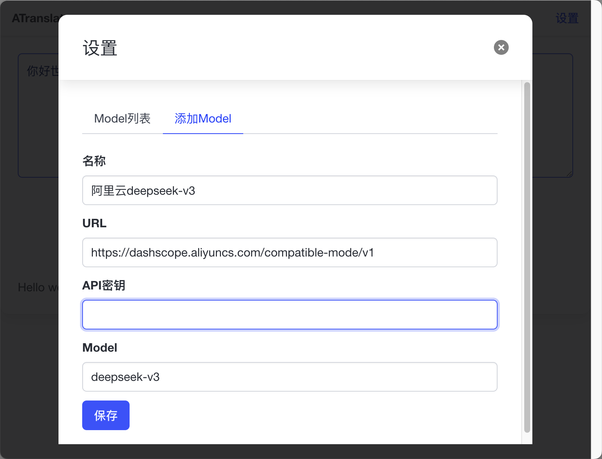
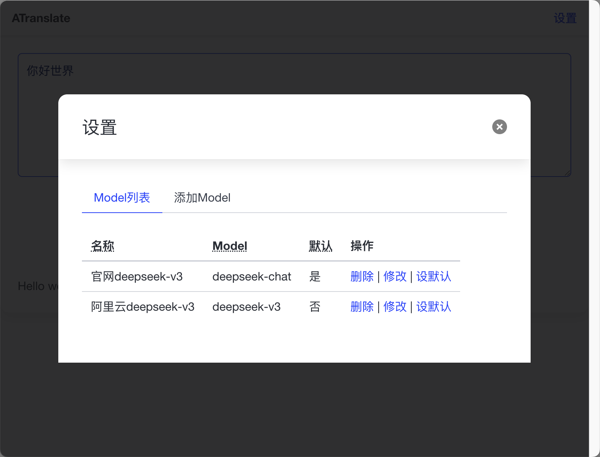

# 简介

Since I couldn't find an AI translation software under macOS, I made a simple one. It can use shortcut keys to read the text on the clipboard for English translation, and it can configure the AI Model API.
中文: [README_CN.md](README_CN.md)
## Main Window

## Settings Window

Set up Deepseek API

## Optional default translation API

## Shortcut Keys
Alt + E: Open the window to read and translate the clipboard content.
Alt + G: Open/Close Window